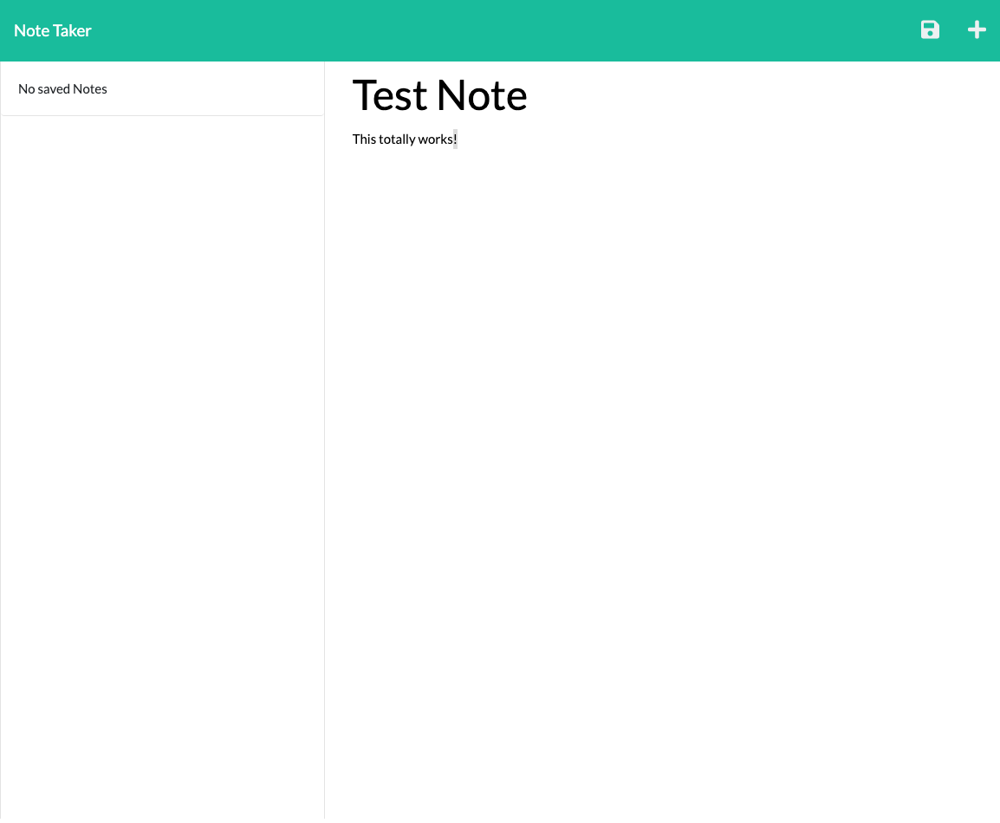

# Note Taker Application

## Description

This is an Express.js powered online note taking application that allows the user to create, update, and delete notes.

## Table of Contents

- [Credits](#credits)
- [Usage](#usage)
- [Contribution](#contribution)
- [License](#license)
- [Questions](#questions)

## Credits

This project is the original work of Dallas Sybrowsky. More of my work is available on GitHub at [DallasSybrowsky](https://github.com/DallasSybrowsky).

## Usage

To use this file click [here](https://arcane-journey-63618.herokuapp.com/) and you will be able to utilize the app.

A screenshot of the deployed app is shown below:

## Contribution

This repo is part of a homework assignment and as such isn't necessarily intended to be modified.

## License

This application is protected under the MIT license. For detailed licensing information please refer to the MIT license information.

## Questions

If you have any questions, you may contact me directly at: dallas.sybrowsky@gmail.com.